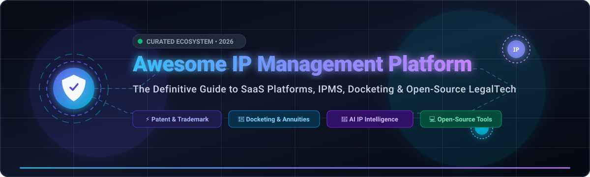

# 🏛️ Awesome IP Management Platform

  

**The Definitive Curated Directory of SaaS Platforms, IPMS, Docketing Engines & Open-Source LegalTech Tools**

*Focused on Patent & Trademark Portfolio Management, Global Docketing, Annuities, Invention Disclosures, Prior Art Search & IP Intelligence*

**Last updated: September 2026**

---

## 📖 Table of Contents

- [🚀 Overview & Ecosystem](#-overview--ecosystem)
- [📊 Market Size & Sector Dynamics](#-market-size--sector-dynamics)
- [🏢 SaaS Products](#-saas-products)
- [💻 Open-Source GitHub Projects](#-open-source-github-projects)
- [🛠️ Open vs Commercial Strategy](#️-open-vs-commercial-strategy)
- [🤝 How to Contribute](#-how-to-contribute)
- [📈 Star History](#-star-history)
- [⚠️ Disclaimer](#️-disclaimer)

---

## 🚀 Overview & Ecosystem

Intellectual Property (IP) Management Platforms (**IPMS**) form the critical infrastructure behind corporate R&D, patent attorneys, law firms, and university technology transfer offices. These systems orchestrate:

- 📋 **Invention Disclosure Capture & Review:** Intake portals for internal inventors, committee review workflows, and patentability assessments.
- 📅 **Global Patent & Trademark Docketing:** Automated deadline calculation across PTO rules (USPTO, EPO, WIPO, JPO, CNIPA, CIPO).
- 💰 **Annuities & Renewal Maintenance:** Cost forecasting, budgeting, and automated payments for granted patent and trademark lifecycles.
- ⚖️ **Prosecution & Office Action Management:** Integration with PAIR, Patent Center, TSDR, and EPO mailboxes for real-time document sync.
- 🧠 **Patent Intelligence & Prior Art Analytics:** AI-powered semantic similarity, citation networks, whitespace identification, and freedom-to-operate (FTO) screening.

---

## 📊 Market Size & Sector Dynamics

> 💡 **Market Overview:** The global **Intellectual Property (IP) Management Software & Services Market** is valued at **~$12.5B – $15.2B in 2026** and is projected to expand to **~$25B – $35B by 2032**, registering a robust Compound Annual Growth Rate (**CAGR of ~12.5% – 14.5%**).
> 
> 🔄 **Market Concentration & Fragmentation:** The sector is **moderately fragmented yet actively consolidating**. Top-tier enterprise consolidators (**Clarivate / CPA Global**, **Questel**, **Anaqua**) dominate large-scale global law firms and Fortune 500 IP departments through aggressive M&A. Concurrently, specialized mid-market SaaS platforms and agile LegalTech innovators (**PatSnap**, **Alt Legal**, **AppColl**, **Triangle IP**) capture high-velocity market share through cloud-native collaboration, transparent pricing, and AI-driven automation.

---

## 🏢 SaaS Products

*Sorted in descending order by **Estimated Company Size / Market Valuation / Annual Revenue**.*

| Platform | Description & Key Capabilities | Estimated Company Size (Valuation / Revenue) | Starting Pricing | Free Tier / Trial Limits |
| :--- | :--- | :--- | :--- | :--- |
| **[CPA Global / FoundationIP](https://www.clarivate.com/)** | Enterprise IPMS providing rule-based patent/trademark docketing, foreign filings, renewal payments, and global prosecution workflows. | **Public (NYSE: CLVT)** • ~$3.6B Market Cap • ~$2.6B Annual Revenue | Enterprise starting tiers begin at ~$30,000/year (~$2,500/month base plus setup/migration) | No permanent free plan; tailored interactive demo and pilot trial environment arranged via sales |
| **[IPfolio](https://www.clarivate.com/products/ip-intelligence/ip-management/ipfolio/)** | Modern cloud-native, Salesforce-based IP management solution focused on corporate IP lifecycle visibility, collaboration, and automated docketing. | **Public (NYSE: CLVT)** • ~$3.6B Market Cap • ~$2.6B Annual Revenue | Entry-level deployments start at ~$20,000/year (~$1,667/month for core corporate portfolio management) | No permanent free plan; guided pilot environment and sandbox evaluation provided during enterprise onboarding consultation |
| **[Questel Orbit / Equinox](https://www.questel.com/)** | Comprehensive IP suite spanning Orbit Intelligence (patent search & analytics) and Equinox (cloud docketing & matter management for firms/corporates). | **Private (Eurazeo / IK Partners backed)** • ~$3.0B+ Valuation • ~$400M+ Annual Revenue | Orbit Intelligence starts at ~$3,000/year (~$250/month); Equinox IPMS starts at ~$350/month for boutique firms | 15-day free trial for Orbit Intelligence patent search platform; guided demo & evaluation instance for Equinox (no permanent free plan) |
| **[Anaqua](https://www.anaqua.com/)** | Category-leading enterprise IP management & intelligence platform (AQX & AcclaimIP) covering invention disclosures, prosecution, and portfolio ROI. | **Private (Nordic Capital / Astorg backed)** • ~$3.0B Valuation • ~$200M+ Annual Revenue | AcclaimIP patent analytics module starts at ~$200/month per user; AQX enterprise suite starts at ~$25,000/year | 7-day to 14-day free trial for AcclaimIP analytics; enterprise AQX provides guided sandbox test accounts upon demo request (no permanent free plan) |
| **[Patricia IP Management](https://www.patrix.com/)** | Highly configurable law firm & corporate IPMS (Patrix / Anaqua) for multi-jurisdictional docketing, cross-border workflows, and cost tracking. | **Part of Anaqua Ecosystem** • ~$3.0B Parent Valuation • ~$20M+ Unit Revenue | Base user licenses start at ~$50–$150/user/month (typical minimum organization deployment begins at ~$10,000/year) | No permanent free plan; interactive proof-of-concept / pilot demonstration available on request |
| **[Dennemeyer / Octimine](https://www.dennemeyer.com/)** | Global IP powerhouse offering full lifecycle services, DIAMS iQ IPMS, Simple IP docketing, and Octimine AI patent search. | **Private (Dennemeyer Group)** • Global Private Powerhouse • ~$150M – $200M Annual Revenue | Simple IP basic tier is $0; Octimine AI search starts at ~$250/month per user; DIAMS iQ enterprise starts at ~$10,000/year | Simple IP offers a free forever plan for small patent portfolios; Octimine offers a limited-query free trial / demo environment |
| **[PatSnap](https://www.patsnap.com/)** | AI-driven connected innovation intelligence, global patent search, landscape analytics, and R&D discovery workflows. | **Private Unicorn (SoftBank / Tencent backed)** • ~$1.0B+ Valuation • ~$80M – $100M Annual Revenue | Eureka Pro starts at $100/month; Enterprise suites start at ~$15,000/year (~$1,250/month); API pay-as-you-go from $100/10k credits | 14-day free trial for Eureka platform (AI patent search, no credit card required); Open Platform API offers a free starter tier with 10,000 credits |
| **[MaxVal IP / Symphony](https://www.maxval.com/)** | Salesforce Lightning-native IP management platform for invention disclosure, prosecution management, annuity tracking, and analytics. | **Private (MaxVal Group)** • Profitable LegalTech Leader • ~$30M – $50M Annual Revenue | Max-Insight basic suite starts with free tier; Symphony IPMS enterprise deployments start at ~$12,000/year (~$1,000/month base) | Max-Insight offers a free forever tier for basic patent search & metrics; Symphony IPMS offers guided pilot demo access upon request |
| **[Inteum](https://www.inteum.com/)** | Specialized IP and technology transfer management system tailored for research universities, health systems, and tech transfer offices. | **Private (Inteum Company)** • Established Tech-Transfer Leader • ~$15M – $25M Annual Revenue | Entry-level hosting / module packages start at $1,350/year (~$112.50/month) | No permanent free plan; guided interactive demo and sandbox trial available upon sales qualification |
| **[InnovationQ Plus](https://ip.com/innovationq-plus/)** | Semantic AI patent discovery, prior art search, and IP litigation/portfolio risk analysis platform by IP.com & IEEE. | **Private (IP.com LLC)** • Established LegalTech / Analytics • ~$10M – $25M Annual Revenue | Starts at $49/user/month for standard search access | Free trial available upon consultation; Free-forever search access provided via IP.com's public Prior Art Database |
| **[Alt Legal](https://www.altlegal.com/)** | Cloud-native automated IP and trademark docketing platform featuring automated USPTO/CIPO docketing, renewal tracking, and client portals. | **Private (Alt Legal Inc.)** • High-Growth SaaS • ~$5M – $15M Annual Revenue | Starts at $60/month (up to 50 active matters; $100/mo up to 100 matters; month-to-month, unlimited users) | Free trial available on request (sandbox test environment) + 30-day money-back guarantee (no permanent free plan) |
| **[Gridlogics / PatSeer](https://www.patseer.com/)** | Comprehensive web-based patent database search, 360° analytics, collaboration workspaces, and competitive monitoring platform. | **Private (Gridlogics Technologies)** • Global IP Search Provider • ~$5M – $10M Annual Revenue | Starts at $900/quarter (~$300/month per user for Explorer/Standard edition) | 14-day (2-week) free trial with full patent search and analytics features (no credit card required; no permanent free plan) |
| **[Triangle IP](https://www.triangleip.com/)** | Drag-and-drop invention capture pipeline, patent prosecution cost estimation, and automated portfolio analytics for growing enterprises. | **Private (Triangle IP Inc.)** • Seed-Stage Venture SaaS • ~$5M – $10M Valuation | Free tier available; Premium plan starts at $50/month ($495/year billed annually for up to 100 users) | Free forever plan (up to 10 users, 1 portfolio, 5 GB storage, 10 MB max file size) & 30-day free trial of Premium features (no credit card required) |
| **[AppColl](https://www.appcoll.com/)** | Cloud-based IP management software offering patent/trademark docketing, task automation, USPTO sync, and legal practice billing. | **Private (AppColl Inc.)** • Established Boutique IPMS • ~$3M – $8M Annual Revenue | Starts at $100/month (PM Plus tier for small portfolios / boutique practices) | 30-day free trial with full feature access and unlimited matters/users (no credit card required; no permanent free plan) |

---

## 💻 Open-Source GitHub Projects

*Sorted in descending order by **GitHub Star Count**.*

- **[google/patents-public-data](https://github.com/google/patents-public-data)**   
  Big data queries, analytics schemas, and sample SQL implementations using Google Patents Public Datasets hosted on Google BigQuery.

- **[ip-tools/python-epo-ops-client](https://github.com/ip-tools/python-epo-ops-client)**   
  Python client library for the European Patent Office (EPO) Open Patent Services (OPS) API with throttling, caching, and multi-endpoint support.

- **[parkerhancock/patent_client](https://github.com/parkerhancock/patent_client)**   
  Pythonic, ORM-style client suite to search, retrieve, and model public patent data from USPTO Patent Examination Data, Assignment APIs, and EPO.

- **[ip-tools/patzilla](https://github.com/ip-tools/patzilla)**   
  Modular open-source patent information research platform and data integration toolkit featuring a modern web UI, REST API, and OPS connector.

- **[PatentsView/PatentsView-Code-Examples](https://github.com/PatentsView/PatentsView-Code-Examples)**   
  Official open-source repository containing Python and R code examples for querying and parsing data from the USPTO PatentsView data platform.

- **[tidwall/uspto-trademark](https://github.com/tidwall/uspto-trademark)**   
  Automated script and open documentation guide on searching, preparing, and filing USPTO trademark applications programmatically.

- **[jjdejong/phpip](https://github.com/jjdejong/phpip)**   
  Open-source patent and IP rights portfolio manager and docketing system (GPL) designed by patent attorneys for law-firm portfolio tracking.

- **[arminnorouzi/patentGPT](https://github.com/arminnorouzi/patentGPT)**   
  LLM-based prototype for AI-driven patent analysis, technical parameter extraction, and claim decomposition.

- **[ropensci/patentsview](https://github.com/ropensci/patentsview)**   
  R client package for accessing, filtering, and analyzing patent data via the USPTO PatentsView API.

- **[DocketAlarm/pacer-api](https://github.com/DocketAlarm/pacer-api)**   
  Python client wrapper for accessing PACER litigation documents and federal patent docket entries.

- **[JYProjs/patentpy](https://github.com/JYProjs/patentpy)**   
  Python package to download, parse, and export bulk USPTO patent grants and applications into rectangular tabular formats.

- **[kamilien1/patentr](https://github.com/kamilien1/patentr)**   
  R package designed for tidy patent data extraction, citation analysis, and visual landscape modeling.

---

## 🛠️ Open vs Commercial Strategy

Building an in-house IP tech stack versus buying an enterprise IPMS involves clear trade-offs:

1. **Self-Hosted / Open-Source Path:**
   - Use **phpIP** or customized relational databases to track basic filing dates and internal matter numbers.
   - Leverage **PatZilla**, **python-epo-ops-client**, and **patent_client** to query official APIs and pull bibliographic data.
   - Organize invention disclosures using self-hosted knowledge bases (e.g. Outline, Wiki.js).
   - *Best for:* Early-stage startups, university research labs, and developer-heavy teams with low docketing volume and custom data science pipelines.

2. **Enterprise Commercial IPMS Path:**
   - High-stakes multi-country filings require **automated docketing rule engines** (calculating statutory deadlines across 100+ patent offices), certified **annuity payment integrations**, and direct electronic office action scraping.
   - *Best for:* Growing enterprises, law firms, and tech corporations where a missed docketing deadline could invalidate millions of dollars in IP rights.

---

## 🤝 How to Contribute

Contributions, corrections, and new platform additions are very welcome!

1. 🍴 Fork the repository.
2. 📝 Add or update entries in `README.md` (ensure pricing, free tier limits, company sizes, and star badges follow the existing format).
3. 🔗 Ensure all URLs point to valid, official websites or GitHub repositories.
4. 🚀 Submit a Pull Request with a clear summary of changes.

⭐ **Star the repo** if you find this ecosystem map helpful!

---

## 📈 Star History

---

## ⚠️ Disclaimer

- This is an independent, **community-curated** resource and does not constitute legal advice or formal endorsement.
- Intellectual property prosecution and portfolio maintenance carry critical deadlines and significant legal liability. Always consult qualified patent attorneys and trademark counsel when managing intellectual property rights.

---

  Curated with ❤️ for IP Counsel, Patent Attorneys, R&amp;D Engineers, and LegalTech Innovators.

